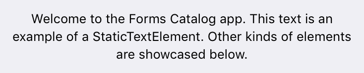

# Formalist [](https://github.com/Carthage/Carthage) [](https://img.shields.io/cocoapods/v/Formalist.svg)  

## Swift framework for building forms on iOS

**Formalist** is a Swift framework for building forms on iOS using a simple, declarative, and readable syntax.

## Table of Contents

- [Example](#example)
- [Installation](#installation)
	- [CocoaPods](#cocoapods)
	- [Carthage](#carthage)
- [Documentation](#documentation)
	- [`FormValue`](#formvalue)
	- [`FormElement`](#formelement)
		- [Responder Chain](#responder-chain)
	- [`ValidationRule`](#validationrule)
	- [`Validatable`](#validatable)
	- [`GroupElement`](#groupelement)
		- [Examples](#examples)
			- [Using constant height form elements](#using-constant-height-form-elements)
			- [Using intrinsically sized form elements with padding](#using-intrinsically-sized-form-elements-with-padding)
			- [Using a custom separator view](#using-a-custom-separator-view)
			- [Using a custom valiation error view](#using-a-custom-valiation-error-view)
	- [`BooleanElement`](#booleanelement)
	- [`SegmentElement`](#segmentelement)
	- [`SpacerElement`](#spacerelement)
	- [`SegueElement`](#segueelement)
	- [`StaticTextElement`](#statictextelement)
	- [`EditableTextElement`](#editabletextelement)
		- [Text Field](#text-field)
		- [Text View](#text-view)
		- [Float Label](#float-label)
	- [`ViewElement`](#viewelement)
	- [`FormViewController`](#formviewcontroller)
- [Testing](#testing)
- [License](#license)
- [Acknowledgements](#acknowledgements)

## Example

<p align="center">

</p>

The example app (shown above) demonstrates how to build a simple form using the included form elements.

This code snippet from the example app is used to render the first section of the form:

```swift
group(configuration: groupedConfiguration, elements: [
    toggle(title: "Boolean Element", value: self.booleanValue),
    textView(value: self.textViewValue) {
        $0.placeholder = "Text View Element"
    },
    singleLineFloatLabel(name: "Float Label Element", value: self.floatLabelValue),
    segments(title: "Segment Element", segments: [
        Segment(content: .Title("Segment 1"), value: "Segment 1"),
        Segment(content: .Title("Segment 2"), value: "Segment 2")
    ], selectedValue: self.segmentValue),
])
```

Note that the above code example uses the built-in convenience functions for constructing each form element, which are syntactic sugar for improving readability over the standard class initializers.

## Installation

In addition to manually integrating the framework into your Xcode project, the following package managers are supported:

### CocoaPods

Add the following line to your `Podfile`:

```ruby
pod 'Formalist', '~> 0.1.0', :submodules => true
```

### Carthage

Add the following line to your `Cartfile`:

```
github "seedco/Formalist" ~> 0.1.0
```

## Documentation

### `FormValue`

`FormValue` is a reference type that wraps form values and allows for observation of those values. After an instance is instantiated with an initial value, the consumer code cannot mutate the value directly. `FormValue` instances are passed into the initializer of form elements (described in the next section), and those form elements bind the UI controls to the `FormValue` instance such that any changes made by the user using those controls result in a modification of the underlying value.

The framework consumer can maintain a reference to a `FormValue` instance to access its value via the `value` property at any time. The consumer can also implement KVO-style observation of the value by attaching block-based observers using the `FormValue.addObserver(_:)` function.

### `FormElement`

The `FormElement` protocol, as its name suggests, is the protocol that all form elements must implement. It contains a single method with the signature `func render() -> UIView`, which is called to render the view for that form element.

A typical implementation of `FormElement` does the following:

* **Initializer**
	* Accepts one or more `FormValue` parameters, which are bound to the UI controls
	* Optionally accepts additional configuration parameters. These parameters are typically related to behaviour rather than appearance, since appearance related properties can be set directly on the view using an optional view configuration block. An example of a behaviour related parameter is the `continuous` parameter to `TextFieldElement`, which determines whether the form value is updated continuously as text is edited.
	* Optionally accepts a view configuration block that can be used to perform additional customization on the element view. This should be the *last parameter* to the initializer so that trailing closure syntax can be used.
* **`render()` function**
	1. Creates the element view
	2. Configures any default properties on the element view
	3. Sets up target-action or another callback mechanism to be notified when a value changes, in order to update the corresponding `FormValue` instance
	4. Invoke the optional view configuration block as the last step for additional view customization
	5. Return the view

#### Responder Chain

The framework implements support for chaining form element views using a responder chain-like construct. This is currently used to implement the built-in tabbing behaviour to switch between text fields in a form by pressing the "return" key on the keyboard.

This behaviour can be supported in custom form elements using the following two steps:

1. Ensure that the view being returned from the `render()` function returns `true` for `canBecomeFirstResponder()`
2. When the view needs to shift focus to the next form view that supports first responder status, it should access the next responder via the `nextFormResponder` property (added in a `UIView` extension by the framework) and call `becomeFirstResponder()` on it. For example, in `TextFieldElement`, this happens as a result of a delegate method being called that indicates that the return key has been pressed.

### `ValidationRule`

`ValidationRule` wraps validation logic for a value of a particular type. Notably, validation rules execute asynchronously -- this means, for example, that you can have a validation rule that kicks off a network request to validate a form value.

A `ValidationRule` is initialized using a block that takes a value and a completion handler as parameters. The block contains the logic necessary to perform the validation and call the completion handler with the result of the validation (one of `Valid`, `Invalid(message: String)`, or `Cancelled`). A failed validation will cause the validation failure message to be presented to the user underneath the form element that caused the failure.

Static computed variables on `ValidationRule` define several built in rules for common cases like required fields and email addresses, and `ValidationRule.fromRegex()` provides a simple way to create a rule that validates a string input using a regular expression.

Validation rules are passed into the constructor of a form element that supports them, like `TextFieldElement`.

### `Validatable`

`Validatable` is the protocol that form elements must implement to support validation of their values. It contains a single method with the signature `func validate(completionHandler: ValidationResult -> Void)`, which should be implemented to perform the validation and calls the completion handler with the validation result. The most common implementation of this method is simply a call to `ValidationRule.validateRules`, which validates a value using a given array of rules.

### `GroupElement`


`GroupElement` is the main non-leaf node type in a form element hierarchy, and implements a number of important behaviours related to the rendering, layout, validation, and interaction amongst a group of form elements.

It implements two styles: `Plain`, which renders the group with no background color and no separators, and `Grouped`, which renders the group with a given background color and separators by default.

The `GroupElement.Configuration` object passed into the initializer can be used to tweak most aspects of the group appearance and behaviour, including the style, layout, separator views, and validation error views.

#### Examples

##### Using constant height form elements

```swift
var configuration = GroupElement.Configuration()
configuration.layout.mode = .ConstantHeight(44)

let groupElement = GroupElement(configuration: configuration, elements: [...])
```

##### Using intrinsically sized form elements with padding

```swift
var configuration = GroupElement.Configuration()
configuration.style = .Grouped(backgroundColor: .whiteColor())
configuration.layout.edgeInsets = UIEdgeInsets(top: 15, left: 15, bottom: 15, right: 15)

let groupElement = GroupElement(configuration: configuration, elements: [...])
```

##### Using a custom separator view

```swift
var configuration = GroupElement.Configuration()
configuration.separatorViewFactory = { (style, isBorder) in
    let separatorView = SeparatorView(axis: .Horizontal)
    separatorView.separatorInset = isBorder ? 0 : 20.0
    separatorView.separatorColor = .redColor()
    separatorView.separatorThickness = 2.0
    return separatorView
}

let groupElement = GroupElement(configuration: configuration, elements: [...])
```

##### Using a custom valiation error view

```swift
var configuration = GroupElement.Configuration()
configuration.validationErrorViewFactory = { message in
    let label = UILabel(frame: CGRectZero)
    label.textColor = .redColor()
    label.textAlignment = .Center    
    label.text = message
    return label
}

let groupElement = GroupElement(configuration: configuration, elements: [...])
```

### `BooleanElement`


`BooleanElement` displays a `UILabel` and a `UISwitch` that is bound to a `Bool` value.

```swift
toggle(title: "Boolean Element", value: self.booleanValue)
```

### `SegmentElement`


`SegmentElement` displays a `UILabel` and a `UISegmentedControl` that is bound to a `Segment<ValueType>` value. `ValueType` is a type parameter the type of the value that the segment represents, which must be consistent for all of the segments. Each segment can have either a title or an image.

```swift
segments(title: "Segment Element", segments: [
    Segment(content: .Title("Segment 1"), value: "Segment 1"),
    Segment(content: .Title("Segment 2"), value: "Segment 2")
], selectedValue: self.segmentValue)
```

### `SpacerElement`

`SpacerElement` displays an empty `UIView` of a fixed height. The view is configurable using all standard `UIView` properties (`backgroundColor`, etc.)

```swift
spacer(height: 20.0)
```

### `SegueElement`


`SegueElement` displays a view with a `UILabel` and an optional `UIImageView` that triggers a configurable action when tapped.

### `StaticTextElement`



`StaticTextElement` displays static, non-editable text using a `UILabel`.

```swift
staticText("Welcome to the Forms Catalog app. This text is an example of a StaticTextElement. Other kinds of elements are showcased below.") {
    $0.textAlignment = .Center
    $0.font = UIFont.preferredFontForTextStyle(UIFontTextStyleFootnote)
}
```

### `EditableTextElement`

`EditableTextElement` is an element that is bound to a `String` value and is capable of rendering several different controls for editable text. While these elements can be created by instantiating `EditableTextElement` directly, it is much simpler to use the convenience functions as shown in the code snippets below.

This element supports a number of different configuration options specified using the `TextEditorConfiguration` struct, including custom Return key behaviours (in addition to the standard tabbing behaviour between fields), as well as validation of the `String` value.

#### Text Field


Displays a `UITextField` for a single line of editable text.

```swift
textField(value: self.emailValue, configuration: TextEditorConfiguration(continuouslyUpdatesValue: true), validationRules: [.email]) {
    $0.autocapitalizationType = .None
    $0.autocorrectionType = .No
    $0.spellCheckingType = .No
    $0.placeholder = "Text Field Element (Email)"
}
```

#### Text View


Displays a `UITextView` for multiple lines of editable text. The text view is actually an instance of `PlaceholderTextView`, which is a `UITextView` subclass that adds support for a placeholder string using the same API as `UITextField`.

```swift
textView(value: self.textViewValue) {
    $0.placeholder = "Text View Element"
}
```

#### Float Label


Implements a native iOS version of the [float label pattern](http://bradfrost.com/blog/post/float-label-pattern/). This concept is excellent for maintaining the context of the field label regardless of whether text has been entered in the field or not, unlike a traditional placeholder.

Float Label comes in two flavors: single line (instantiated using the `singleLineFloatLabel` function) and multi-line (instantiated using the `multiLineFloatLabel` function). The single line variant uses a `UITextField` as its underlying editor view, and the multi-line variant uses a `PlaceholderTextView` (`UITextView subclass`). In both cases, the underlying editor view can be accessed via the `FloatLabel.textEntryView` property inside the optional view configurator block.


```swift
singleLineFloatLabel(name: "Float Label Element", value: self.floatLabelValue)
```

### `ViewElement`

`ViewElement` provides an easy way to wrap an existing view to create a one-off custom form element without any subclassing. It is used to implement the activity indicator element shown in the example application. It has to be initialized with a `FormValue` instance, which is then passed into the block that creates the custom view. However, if the view is not bound to a value (like in the activity indicator), you may simply pass a dummy value and ignore it inside the block.

```swift
customView(value: FormValue("")) { _ in
    let activityIndicator = UIActivityIndicatorView(activityIndicatorStyle: .Gray)
    activityIndicator.startAnimating()
    return activityIndicator
}
```

### `FormViewController`

`FormViewController` is a `UIViewController` subclass that can be used standalone or embedded inside a parent view controller using [view controller containment](https://developer.apple.com/library/ios/featuredarticles/ViewControllerPGforiPhoneOS/ImplementingaContainerViewController.html) to display form content in your app.

```swift
let formViewController = FormViewController(elements: [
    singleLineFloatLabel(name: "Name", value: self.nameValue),
    singleLineFloatLabel(name: "Email", value: self.emailValue, validationRules: [.email]),
    singleLineFloatLabel(name: "Password", value: self.passwordValue) {
        $0.textEntryView.secureTextEntry = true
    }
])

addChildViewController(formViewController)
view.addSubview(formViewController.view)
formViewController.view.activateSuperviewHuggingConstraints()
formViewController.didMoveToParentViewController(self)
```

## Testing

The framework is tested using a combination of snapshot tests via [FBSnapshotTestCase](https://github.com/facebook/ios-snapshot-test-case) and automated UI testing in Xcode.

## License

This project is licensed under the MIT license. See `LICENSE.md` for more details.

## Acknowledgements

Formalist uses [StackViewController](https://github.com/seedco/StackViewController) and [FBSnapshotTestCase](https://github.com/facebook/ios-snapshot-test-case).
